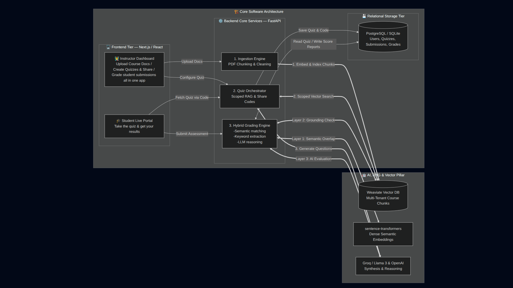

# EduSage — AI Quiz Generation, Proctoring & Automated Grading Platform

An AI-powered educational assessment platform that enables instructors to generate quizzes from course materials, conduct secure online assessments, and automatically grade subjective answers using a Retrieval-Augmented Generation (RAG) pipeline and a Three-Tier Hybrid Grading Engine.

---

## Overview

EduSage streamlines the complete assessment lifecycle—from document ingestion to automated grading.

Instead of relying solely on keyword matching or large language models, EduSage combines semantic retrieval, deterministic validation, and AI reasoning to produce explainable, consistent, and scalable grading suitable for real educational environments.

---

## The Problem

Creating and grading assessments remains one of the most time-consuming responsibilities for educators.

Current solutions typically suffer from one or more of the following limitations:

- Manual quiz creation requires significant preparation time.
- Traditional keyword-based grading cannot measure conceptual understanding.
- Pure LLM-based grading is expensive, non-deterministic, and susceptible to hallucinations.
- Students often receive only numerical scores without meaningful feedback.

---

## The Solution

EduSage provides an end-to-end assessment platform that:

- Generates quizzes directly from uploaded educational content.
- Restricts question generation to instructor-selected chapters.
- Uses Retrieval-Augmented Generation (RAG) for grounded content generation.
- Performs secure online examinations.
- Automatically grades both objective and subjective responses.
- Produces explainable grading with structured reasoning instead of opaque scores.

---

# System Architecture

<p align="center">
  
</p>

---

## End-to-End Workflow

### 1. Document Ingestion

Instructors upload course material in PDF or DOCX format.

The backend:

- extracts text
- chunks documents
- generates embeddings
- stores vectors in a multi-tenant Weaviate database

---

### 2. Quiz Generation

The instructor selects:

- chapters
- difficulty level
- question distribution

The backend performs scoped hybrid retrieval over the vector database before sending grounded context to the LLM for quiz generation.

A unique six-character share code is generated for student access.

---

### 3. Student Assessment

Students:

- join using the share code
- complete the timed assessment
- submit responses through the web interface

Objective questions are graded immediately while subjective responses enter the grading pipeline.

---

### 4. Automated Grading

Multiple Choice Questions are graded deterministically.

Subjective answers are evaluated using the Three-Tier Hybrid Grading Engine before generating:

- final score
- reasoning trace
- instructor feedback

---

## Three-Tier Hybrid Grading Engine

Rather than trusting an LLM alone, EduSage validates every subjective answer through three independent stages.

### Layer 1 — Semantic Similarity

Dense vector embeddings compare the student's answer against the reference solution to measure conceptual similarity.

This stage evaluates whether the student discusses the correct ideas even if different wording is used.

---

### Layer 2 — Keyword Verification

Critical domain-specific terminology is verified.

This prevents high semantic similarity scores from vague or incomplete answers that omit essential concepts.

---

### Layer 3 — LLM Reasoning

The LLM retrieves the original educational context from the vector database before evaluating:

- logical correctness
- completeness
- conceptual accuracy

Finally, it generates structured feedback explaining why marks were awarded or deducted.

This grounding process significantly reduces hallucinations while improving grading transparency.

---

## Technology Stack

### Artificial Intelligence

- Groq (Llama 3)
- OpenAI
- HuggingFace Sentence Transformers

### Retrieval-Augmented Generation

- LangChain
- LangGraph
- Custom Scoped Retrieval Pipeline

### Vector Database

- Weaviate
- Multi-tenant vector architecture

### Backend

- Python
- FastAPI
- SQLAlchemy
- Pydantic
- Uvicorn

### Database

- PostgreSQL
- SQLite

### Frontend

- Next.js (App Router)
- React
- Tailwind CSS
- Headless UI

---

## Repository Structure

```text
backend/
│
├── app/
│   ├── api/                 # REST API endpoints
│   ├── core/                # Configuration and security
│   ├── crud/                # Database operations
│   ├── models/              # SQLAlchemy models
│   ├── services/
│   │   ├── rag/             # Retrieval pipelines
│   │   ├── grading/         # Hybrid grading engine
│   │   └── embeddings/      # Embedding services
│   └── main.py
│
└── requirements.txt


edusage-frontend/
│
├── app/
│   ├── quiz-workspace/      # Instructor dashboard
│   ├── take-quiz/           # Student assessment interface
│   ├── results/             # Student reports
│   └── quick-study/         # Practice mode
│
└── package.json
```

---

## Performance Goals

| Metric | Traditional Workflow | EduSage |
|---------|----------------------|----------|
| Quiz Creation | 1–2 hours | < 60 seconds |
| Grade 30 Subjective Responses | 2–3 hours | < 2 minutes |
| Grading Consistency | Depends on instructor | Standardized |
| Student Feedback | Numerical score only | Score + reasoning |

---

## Key Features

- Retrieval-Augmented Quiz Generation
- Chapter-Level Scoped Retrieval
- Three-Tier Hybrid Subjective Grading
- Automatic MCQ Evaluation
- Explainable AI Feedback
- Multi-Tenant Vector Database
- Secure Online Assessment
- Instructor Analytics Dashboard
- Student Progress Reports
- Modular AI Service Architecture

---

## Design Principles

EduSage was designed around four engineering goals:

- **Accuracy** — Ground AI decisions using retrieved educational context.
- **Explainability** — Every subjective grade includes a reasoning trace.
- **Scalability** — Multi-tenant architecture supports multiple institutions.
- **Modularity** — AI services remain independent for future model upgrades.

---

## Future Improvements

- Adaptive testing
- Bloom's Taxonomy-aware question generation
- AI-assisted rubric generation
- LMS integrations
- Real-time collaborative assessments
- Learning analytics dashboard
- Personalized student study recommendations
